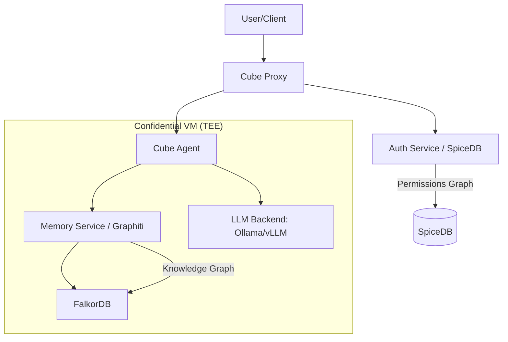

# Comprehensive Plan: ReBAC-Gated Knowledge Graphs for Cube AI

This document details the architectural integration and application of ReBAC (Relationship-Based Access Control) gated Knowledge Graphs within the Cube AI framework. This approach ensures that AI agents possess long-term, evolving memory that is strictly partitioned according to user permissions.

## 1. Architecture Overview

The architecture follows a "Dual-Graph" strategy, separating *what* is known from *who* is allowed to know it.

### System Components

- **Knowledge Layer (Graphiti + FalkorDB):** A temporal knowledge graph that extracts facts and entities from conversations. It versions memories, allowing the agent to "remember" how a fact changed over time (e.g., from "Drafting" to "Published").
- **Gating Layer (SpiceDB):** Uses Google Zanzibar-style ReBAC. It defines relationships like `user:alice is_member_of group:sec-ops`.
- **Query Interceptor (Cube Agent):** The agent acts as the gatekeeper. When a query arrives:
    1. It queries **SpiceDB** to get a list of authorized groups for the current user.
    2. It filters the **Graphiti** search results using these authorized group IDs.
    3. It augments the LLM prompt only with facts the user is permitted to see.

---

## 2. Use Cases & Applications

### Enterprise Data Governance
- **Internal Knowledge Bot:** An engineer asking about a "Database Migration" gets different answers than a HR manager asking about "Employee Salaries," even if both use the same shared agent.
- **Cross-Departmental Collaboration:** Securely sharing specific "project-level" nodes in the knowledge graph while keeping "department-level" nodes private.

### Multi-Tenant SaaS
- **SaaS Agent:** A single Cube deployment serving multiple client organizations. ReBAC ensures organization A's memory never leaks into organization B's context, even if they share the same model weights.

### Private Family/Personal Memory
- **Family Hub:** Parents and children interact with the same family assistant. The agent remembers the "Family Trip" facts for everyone, but only the parents can access "Financial Planning" nodes.

---

## 3. Implementation Plan (The "Plant")

### Phase 1: Infrastructure Setup
- [ ] Add `falkordb` to `docker/cube-compose.yaml`.
- [ ] Implement `memory-service` in Python (using Zep's Graphiti library).
- [ ] Configure `spicedb` (already present) with the necessary schema for "Resource Groups".

### Phase 2: Agent Enhancement
- [ ] Modify `agent/agent.go` to support context augmentation.
- [ ] Implement the `spicedb.lookupResources` call within the agent's proxy logic.
- [ ] Pass authorized `group_ids` to the `memory-service` during retrieval.

### Phase 3: Extraction & Update
- [ ] Implement post-turn fact extraction. After the LLM responds, the agent sends the turn (user message + assistant response) to the `memory-service` to update the Knowledge Graph.
- [ ] Ensure extraction happens asynchronously to minimize latency.

---

## 4. User Review Required

> [!IMPORTANT]
> **Performance Impact:** Fact extraction and graph retrieval add latency. We recommend running FalkorDB with high-performance memory settings.
> 
> **TEE Resources:** Running Graphiti/FalkorDB inside the Confidential VM will require increasing the allocated memory for the CVM.

## 5. Verification Roadmap

1. **Isolation Test:** Create two users in different domains. Verify that info shared by User A is never retrieved by User B.
2. **Temporal Test:** Change a fact in a conversation (e.g., "The project is now Active"). Verify that Graphiti updates the node rather than creating a duplicate.
3. **ReBAC Revocation:** Remove a user's relationship in SpiceDB and verify they immediately lose access to the associated memories.
