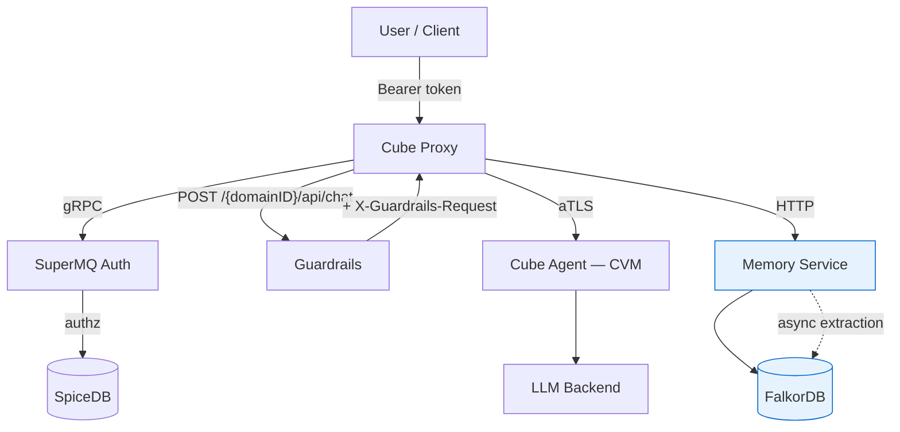

# Comprehensive Plan: ReBAC-Gated Knowledge Graphs for Cube AI

This document details the architectural integration of ReBAC (Relationship-Based Access Control) gated Knowledge Graphs within the Cube AI framework. The goal is to give AI agents long-term, evolving memory that is strictly partitioned according to existing SuperMQ user permissions and domain boundaries.

---

## 1. Current Architecture (Context)

Before describing the design, it is important to ground the plan in _what already exists_.

### Request Flow Today

```
User → Traefik → Cube Proxy (Go)
                    │
                    ├── SuperMQ Auth (gRPC)  ← authenticates JWT, returns Session
                    ├── SpiceDB (via authz)  ← checks domain-level permissions
                    ├── Router (config.json) ← selects target: agent, guardrails, opensearch
                    │
                    └──► Cube Agent (Go, inside CVM/TEE)
                              │
                              └──► LLM Backend (Ollama / vLLM)
```

**Key characteristics that the memory system must respect:**

| Component | Where it runs | What it knows about users |
|-----------|---------------|---------------------------|
| **Cube Proxy** | Host / Docker | Full authn Session (UserID, DomainID, DomainUserID) |
| **Cube Agent** | Inside Confidential VM | Nothing — strips `Authorization` header before forwarding to LLM |
| **SpiceDB** | Host / Docker | Authorization graph (platform → org → team → domain → role → user) |
| **Guardrails** | Host / Docker | Receives `X-Domain-ID` header from proxy |

### Existing SpiceDB Schema Hierarchy

```
platform
  └── organization
        └── team
              └── domain
                    └── role
                          └── user
```

Domains already have granular LLM permissions (`llm_chat_completions_permission`, `llm_read_permission`, etc.), audit log permissions, and entity permissions. **The memory system should re-use this hierarchy rather than invent a parallel "resource group" concept.**

---

## 2. Architecture Design

### Dual-Graph Strategy

The design separates _what is known_ (Knowledge Graph) from _who is allowed to know it_ (SpiceDB Authorization Graph).


```mermaid
graph TD
    User[User / Client] -->|"Bearer token"| Proxy[Cube Proxy]
    Proxy -->|gRPC| Auth[SuperMQ Auth]
    Auth -->|authz| SpiceDB[(SpiceDB)]

    Proxy -->|"POST /{domainID}/api/chat"| GR[Guardrails]
    GR -->|"+ X-Guardrails-Request"| Proxy
    Proxy -->|"aTLS"| Agent[Cube Agent — CVM]
    Agent --> LLM[LLM Backend]

    Proxy -->|"HTTP"| MemSvc[Memory Service]
    MemSvc --> GraphDB[(FalkorDB)]
    MemSvc -.->|"async extraction"| GraphDB

    style MemSvc fill:#e6f3ff,stroke:#0066cc
    style GraphDB fill:#e6f3ff,stroke:#0066cc
```

### Where Each New Component Lives

| Component | Runs | Reason |
|-----------|------|--------|
| **Memory Service** (Python, Graphiti) | **Host / Docker** — same network as proxy | Needs to call SpiceDB for permissions; does NOT handle raw model weights. Keeping it outside the CVM avoids bloating the TEE footprint and allows persistent storage. |
| **FalkorDB** (Redis-compatible graph DB) | **Host / Docker** | Persistent storage that survives CVM restarts. Connected only to the Memory Service, not exposed externally. |

> **TEE consideration:** The LLM inference and attestation remain inside the CVM. The Memory Service handles _metadata and facts extracted from conversations_, not the raw model. If maximum confidentiality of conversation metadata is required in the future, the Memory Service can be migrated into a second CVM, but this is not necessary for the initial implementation.

---

## 3. Data Model

### 3.1 Knowledge Graph Nodes (FalkorDB / Graphiti)

Every fact node in the knowledge graph is tagged with ownership metadata:

```
(:Entity {
    name: "Database Migration Plan",
    fact: "Migration scheduled for Q2 2026",
    domain_id: "d-abc-123",           // SuperMQ domain that owns this fact
    group_ids: ["g-eng-team"],        // Optional: finer-grained groups within domain
    created_by: "user-id-456",
    created_at: "2026-03-13T10:00:00Z",
    valid_at: "2026-03-13T10:00:00Z", // Graphiti temporal field
    invalid_at: null                   // null = still valid
})
```

### 3.2 SpiceDB Schema Additions

Extend the existing `domain` definition in [docker/spicedb/schema.zed](docker/spicedb/schema.zed) with memory permissions:

```zed
// Inside the existing "definition domain" block, add:

relation memory_read: role#member | team#member
relation memory_write: role#member | team#member
relation memory_delete: role#member | team#member
relation memory_manage_role: role#member | team#member
relation memory_add_role_users: role#member | team#member
relation memory_remove_role_users: role#member | team#member
relation memory_view_role_users: role#member | team#member

permission memory_read_permission = memory_read + team->memory_read + organization->admin
permission memory_write_permission = memory_write + team->memory_write + organization->admin
permission memory_delete_permission = memory_delete + team->memory_delete + organization->admin
permission memory_manage_role_permission = memory_manage_role + team->memory_manage_role + organization->admin
permission memory_add_role_users_permission = memory_add_role_users + team->memory_add_role_users + organization->admin
permission memory_remove_role_users_permission = memory_remove_role_users + team->memory_remove_role_users + organization->admin
permission memory_view_role_users_permission = memory_view_role_users + team->memory_view_role_users + organization->admin
```

Also add `memory_*` relations to the `team` definition and update `domain.membership` to include the new memory permissions.

### 3.3 Permission Mapping (permission.yaml)

Add to [docker/permission.yaml](docker/permission.yaml):

```yaml
    # Memory operations
    - memory_read: memory_read_permission
    - memory_write: memory_write_permission
    - memory_delete: memory_delete_permission
```

---

## 4. Request Flows

### 4.1 Chat with Memory Augmentation (Read Path)

```
1. User → POST /{domainID}/api/chat  {"messages": [...]}
2. Proxy authenticates (SuperMQ Auth gRPC → Session with UserID, DomainID)
3. Proxy authorizes (SpiceDB: llm_chat_completions_permission on domain)
4. Proxy calls Memory Service:
     GET /memory/search?domain_id={domainID}&user_id={userID}&q={last user message}
     Memory Service internally:
       a. Calls SpiceDB: CheckPermission(user, "memory_read", domain)
       b. Queries Graphiti: search(q, filters={domain_id, group_ids})
       c. Returns ranked facts
5. Proxy injects retrieved facts into the messages array as a system context message:
     {"role": "system", "content": "Relevant context from memory:\n- Fact 1\n- Fact 2"}
6. Proxy forwards augmented request → Router → Guardrails → Agent → LLM
7. LLM responds
8. Proxy asynchronously sends the turn to Memory Service for extraction:
     POST /memory/extract  {"domain_id": ..., "user_id": ..., "messages": [...], "response": ...}
```

### 4.2 Post-Turn Fact Extraction (Write Path — Async)

```
1. Memory Service receives the complete turn (user messages + assistant response)
2. Graphiti extracts entities, facts, and relationships
3. Each new node is tagged with domain_id, created_by user_id
4. Graphiti handles temporal versioning (invalidating old facts when contradicted)
```

This happens **asynchronously** so it does not add latency to the user's chat response.

### 4.3 Where Augmentation Happens: The Proxy

The **Cube Proxy** is the correct interception point because:

- It has the full user Session (UserID, DomainID) — the agent does not.
- It already modifies requests (strips paths, injects headers like `X-Domain-ID`).
- It can call the Memory Service on the same Docker network without crossing the TEE boundary.
- It can fire-and-forget the async extraction call after streaming the LLM response back.

The **agent** (`agent/agent.go`) should **NOT** be modified for memory. It remains a minimal attestation + reverse-proxy inside the CVM.

---

## 5. Memory Service Design

### 5.1 Technology Stack

The Memory Service is written in **Go** to match the rest of the Cube codebase (proxy, agent). Graphiti runs as a sidecar container accessed via its REST API.

| Layer | Technology | Reason |
|-------|-----------|--------|
| **Memory Service API** | **Go** (net/http or chi) | Matches proxy/agent patterns; uses existing SuperMQ auth libraries directly |
| **SpiceDB client** | [`authzed-go`](https://github.com/authzed/authzed-go) | Already a direct dependency of SuperMQ — zero new deps for authz |
| **FalkorDB client** | [`falkordb-go`](https://github.com/FalkorDB/falkordb-go) v2 | Official Go client, actively maintained (BSD-3) |
| **Knowledge Graph logic** | [Graphiti server](https://github.com/getzep/graphiti) (sidecar) | Runs as a Docker container exposing a REST API. Handles temporal entity extraction, versioning, and contradiction resolution. No Go SDK exists, but the REST API is stable. |
| **Graph DB** | FalkorDB | Redis-compatible graph database; Graphiti's recommended backend |
| **Embeddings** | Same LLM backend (via proxy) or dedicated model | Graphiti needs embeddings for semantic search; configured via env vars on the Graphiti sidecar |

#### Why Go + Graphiti sidecar (not pure Python or pure Go)

| Option | Pros | Cons |
|--------|------|------|
| **Python service (Graphiti native)** | Direct Graphiti SDK access | Inconsistent with Go codebase; cannot reuse SuperMQ auth/middleware libraries; separate build toolchain |
| **Pure Go (no Graphiti)** | Single language; full control | Must reimplement temporal reasoning, LLM-driven extraction, contradiction detection, episode provenance — months of work |
| **Go service + Graphiti sidecar** *(recommended)* | Go for auth/API/routing (reuses SuperMQ patterns); Graphiti handles complex KG logic behind a REST API | Extra container; REST call overhead (~1-5ms on Docker network) |

The Go Memory Service handles:
- Authentication / authorization (SpiceDB via `authzed-go`)
- Request validation, rate limiting, domain scoping
- Calling Graphiti's REST API for search / extraction
- Direct FalkorDB queries for simple read operations (list facts, delete fact)
- Async extraction dispatch

The Graphiti sidecar handles:
- LLM-driven entity/relationship extraction from conversation turns
- Temporal fact versioning (valid_at / invalid_at)
- Contradiction detection and resolution
- Semantic search with embeddings

### 5.2 API Endpoints

```
# Retrieval — called by proxy before forwarding to LLM
GET  /memory/search
     ?domain_id={domainID}
     &user_id={userID}
     &q={query text}
     → 200 { "facts": [ {"text": "...", "score": 0.95, "entity": "...", "valid_at": "..."} ] }

# Extraction — called by proxy after LLM response (async / fire-and-forget)
POST /memory/extract
     { "domain_id": "...", "user_id": "...", "conversation_id": "...",
       "messages": [...], "response": "..." }
     → 202 Accepted

# Manual memory management — exposed through proxy with auth
GET    /memory/facts?domain_id={domainID}&entity={optional}
POST   /memory/facts          { "domain_id": "...", "fact": "...", "entity": "..." }
DELETE /memory/facts/{factID}
```

### 5.3 Authorization Within the Memory Service

The Memory Service receives `domain_id` and `user_id` from the proxy (which has already authenticated the user). For defense-in-depth, the Memory Service also verifies permissions using `authzed-go` (the same SpiceDB client SuperMQ uses):

```go
func (s *service) SearchMemory(ctx context.Context, domainID, userID, query string) ([]Fact, error) {
    // Double-check: does this user have memory_read on this domain?
    resp, err := s.spicedb.CheckPermission(ctx, &v1.CheckPermissionRequest{
        Resource:   &v1.ObjectReference{ObjectType: "domain", ObjectId: domainID},
        Permission: "memory_read_permission",
        Subject:    &v1.SubjectReference{Object: &v1.ObjectReference{ObjectType: "user", ObjectId: userID}},
    })
    if err != nil || resp.Permissionship != v1.CheckPermissionResponse_PERMISSIONSHIP_HAS_PERMISSION {
        return nil, svcerr.ErrAuthorization
    }

    // Call Graphiti sidecar REST API, scoped to this domain
    results, err := s.graphitiClient.Search(ctx, graphiti.SearchRequest{
        Query:    query,
        GroupIDs: []string{domainID},
        NumResults: 10,
    })
    if err != nil {
        return nil, fmt.Errorf("graphiti search: %w", err)
    }

    return toFacts(results), nil
}
```

---

## 6. Integration Points with Existing Code

### 6.1 Proxy Changes (`proxy/`)

| File | Change |
|------|--------|
| [proxy/proxy.go](proxy/proxy.go) | Add `MemoryService` interface: `SearchMemory(ctx, domainID, userID, query) ([]Fact, error)` and `ExtractMemory(ctx, domainID, userID, conversationID, messages, response) error` |
| [proxy/service.go](proxy/service.go) | Inject a `memoryClient` (Go HTTP client to Memory Service). Implement `SearchMemory` / `ExtractMemory` methods. The client uses the same patterns as the existing `httpclient` in `cocos/pkg/clients/http`. |
| [proxy/api/transport.go](proxy/api/transport.go) | In `makeProxyHandler` or a new middleware: before forwarding chat requests, call `SearchMemory` and inject facts into the request body. After getting the response, fire async `ExtractMemory`. |
| [proxy/middleware/auth.go](proxy/middleware/auth.go) | Add `memory_read_permission`, `memory_write_permission`, `memory_delete_permission` constants. Add path matching for `/memory/*` routes to `determinePermission()`. |

### 6.2 Router Changes (`docker/config.json`)

Add a route for the Memory Service:

```json
{
  "name": "memory-service",
  "target_url": "http://memory-service:8002",
  "matchers": [
    {
      "condition": "path",
      "pattern": "^.*/memory/.*",
      "is_regex": true
    }
  ],
  "priority": 18,
  "strip_prefix": "/memory",
  "enabled": true,
  "event_type": "memory_request",
  "atls": false
}
```

### 6.3 Docker Compose Changes (`docker/cube-compose.yaml`)

```yaml
  falkordb:
    image: falkordb/falkordb:latest
    container_name: cube-falkordb
    restart: on-failure
    networks:
      - cube-network
    volumes:
      - cube-falkordb-volume:/data
    healthcheck:
      test: ["CMD", "redis-cli", "ping"]
      interval: 10s
      timeout: 5s
      retries: 5

  graphiti:
    image: zepai/graphiti:latest
    container_name: cube-graphiti
    restart: on-failure
    networks:
      - cube-network
    depends_on:
      falkordb:
        condition: service_healthy
    environment:
      GRAPH_DB_PROVIDER: falkordb
      GRAPH_DB_URL: redis://falkordb:6379
      OPENAI_BASE_URL: http://cube-proxy:${UV_CUBE_PROXY_PORT}/v1
      OPENAI_API_KEY: "not-needed"  # proxy handles auth; key is required but unused
      MODEL_NAME: ${UV_CUBE_UI_LLM_DEFAULT_MODEL}
    ports:
      - "8003:8003"
    labels:
      logging: "graphiti"
      service: "graphiti"

  memory-service:
    container_name: cube-memory-service
    image: ghcr.io/ultravioletrs/cube/memory-service:latest
    restart: on-failure
    networks:
      - cube-network
    depends_on:
      - falkordb
      - graphiti
      - spicedb
    environment:
      UV_MEMORY_LOG_LEVEL: ${UV_MEMORY_LOG_LEVEL:-info}
      UV_MEMORY_HTTP_PORT: 8002
      UV_MEMORY_FALKORDB_URL: redis://falkordb:6379
      UV_MEMORY_GRAPHITI_URL: http://graphiti:8003
      SMQ_SPICEDB_HOST: ${SMQ_SPICEDB_HOST}
      SMQ_SPICEDB_PORT: ${SMQ_SPICEDB_PORT}
      SMQ_SPICEDB_PRE_SHARED_KEY: ${SMQ_SPICEDB_PRE_SHARED_KEY}
    ports:
      - "8002:8002"
    labels:
      logging: "memory-service"
      service: "memory"
    logging:
      driver: "json-file"
      options:
        max-size: "10m"
        max-file: "3"
        labels: "logging,service"
        tag: "memory-service|{{.Name}}"
```

Add volume:
```yaml
volumes:
  cube-falkordb-volume:
```

> **Note:** The Graphiti sidecar calls the LLM for entity extraction via `OPENAI_BASE_URL` pointed at the Cube Proxy. This means extraction requests flow through the same proxy→agent→LLM pipeline and are subject to the same aTLS/attestation guarantees. The `OPENAI_API_KEY` is required by the Graphiti server but is not used when the LLM backend doesn't require one.

### 6.4 SpiceDB Schema (`docker/spicedb/schema.zed`)

See section 3.2 above. Also add `memory_*` relations to the `team` definition and include the new permissions in the `domain.membership` union.

### 6.5 No Changes to Agent

The [agent/agent.go](agent/agent.go) and [agent/api/transport.go](agent/api/transport.go) files are **NOT** modified. The agent remains a minimal attestation + reverse-proxy inside the CVM. Memory augmentation and extraction are handled entirely at the proxy layer.

---

## 7. Conversation Tracking

The current architecture has no concept of a conversation ID. This is needed for:

- Grouping messages into sessions for coherent fact extraction
- Allowing users to manage memory per-conversation

**Approach:** The proxy generates or propagates a `X-Conversation-ID` header (UUID). The UI can send it; if absent, the proxy generates one. This ID is passed to:

1. The Memory Service (for extraction grouping)
2. The audit log (for traceability)
3. The Guardrails service (already receives `X-Domain-ID`; add `X-Conversation-ID`)

---

## 8. Guardrails Integration

The Guardrails service currently processes chat requests _before_ they reach the LLM. The memory augmentation flow interacts with guardrails as follows:

```
User message
  → Proxy: authenticate + authorize
  → Proxy: SearchMemory → inject context into messages
  → Router → Guardrails (validates the augmented messages)
  → Router → Agent → LLM
  → Proxy: ExtractMemory (async, fire-and-forget)
```

Memory retrieval happens **before** guardrails so that the guardrails can validate the _complete_ prompt including retrieved context. This ensures that any injected memory facts also pass through input validation rails.

---

## 9. Dynamic Memory Toggle

Enterprise deployments require the ability to enable or disable the memory system **at runtime** without redeploying containers or restarting services. This section defines the toggle granularity, storage, and runtime behavior.

### 9.1 Toggle Granularity

| Level | Who controls it | Scope | Use case |
|-------|----------------|-------|----------|
| **System-wide** | Platform admin | All domains | Emergency kill-switch, maintenance windows, resource constraints |
| **Per-domain** | Domain admin | Single domain | Enterprise tenant that opts out of memory, compliance restrictions |
| **Per-user** | Individual user | Their own sessions | User privacy preference — "don't remember my conversations" |

All three levels are evaluated at request time. The proxy skips memory augmentation if **any** level is disabled:

```
system_enabled AND domain_enabled AND user_enabled → memory is active
```

### 9.2 Configuration Storage

| Level | Where stored | How modified |
|-------|-------------|-------------|
| **System-wide** | Environment variable `UV_MEMORY_ENABLED` (default: `true`) + runtime override in Memory Service config endpoint | Platform admin calls `PUT /memory/config {"enabled": false}` or sets env var and restarts |
| **Per-domain** | SuperMQ domain metadata (key: `memory_enabled`, value: `true`/`false`) | Domain admin calls `PUT /{domainID}/memory/config {"enabled": false}` → stored in domain settings |
| **Per-user** | User preference in SuperMQ or a lightweight key-value store | User calls `PUT /memory/preferences {"enabled": false}` |

> **Design choice:** Per-domain and per-user settings are stored in the existing SuperMQ domain/user metadata rather than introducing a new database. The Memory Service reads these settings via the SuperMQ API or caches them locally with a short TTL.

### 9.3 Runtime Behavior

When memory is disabled at any level, the proxy's memory middleware **short-circuits** — it does not call the Memory Service at all. This means:

- **Zero latency impact** when memory is off (no HTTP call, no timeout)
- **No fact extraction** — conversations are not recorded into the knowledge graph
- **Memory Service containers keep running** — they serve the management API (list/delete facts) regardless of the toggle. Only augmentation and extraction are gated.

```go
// In proxy memory middleware (proxy/api/transport.go)
func (m *memoryMiddleware) augmentRequest(ctx context.Context, session authn.Session, req *ChatRequest) {
    // Check toggle hierarchy: system → domain → user
    if !m.memoryClient.IsEnabled(ctx, session.DomainID, session.UserID) {
        return // skip memory entirely — zero overhead
    }

    facts, err := m.memoryClient.SearchMemory(ctx, session.DomainID, session.UserID, req.LastUserMessage())
    if err != nil {
        // Log and proceed without augmentation — memory failure must not break chat
        m.logger.Warn("memory search failed", "error", err)
        return
    }
    req.InjectContext(facts)
}
```

### 9.4 Toggle API Endpoints

Exposed through the proxy (with appropriate permissions):

```
# System-wide toggle (platform admin only)
PUT  /memory/config
     { "enabled": true|false }
     → 200 { "enabled": true|false, "level": "system" }

# Per-domain toggle (domain admin)
PUT  /{domainID}/memory/config
     { "enabled": true|false }
     → 200 { "enabled": true|false, "level": "domain" }

# Per-user preference
PUT  /memory/preferences
     { "enabled": true|false }
     → 200 { "enabled": true|false, "level": "user" }

# Read current effective state
GET  /{domainID}/memory/status
     → 200 { "effective": true|false, "system": true, "domain": true, "user": false }
```

### 9.5 SpiceDB Permissions for Toggle Management

Add to the `domain` definition in SpiceDB:

```zed
relation memory_config: role#member | team#member
permission memory_config_permission = memory_config + team->memory_config + organization->admin
```

The system-wide toggle requires `platform.admin`. Per-domain toggle requires `memory_config_permission` on the domain. Per-user toggle requires only the user's own authenticated session.

### 9.6 Caching Strategy

To avoid querying SuperMQ domain metadata on every request:

- **System-wide flag:** Held in-memory in the proxy process. Updated via admin API call (no external lookup needed).
- **Per-domain flags:** Cached in-memory with a **30-second TTL**. A domain admin toggling memory off takes effect within 30 seconds across all proxy instances.
- **Per-user flags:** Cached in-memory with a **60-second TTL**. Users toggling their preference see the change within 60 seconds.

Cache invalidation is TTL-based (simple, no pub/sub needed). For immediate effect, the admin can call a cache-flush endpoint.

### 9.7 Default State

| Level | Default | Rationale |
|-------|---------|----------|
| System-wide | **Enabled** | Memory is a core feature; platform admin disables only if needed |
| Per-domain | **Disabled** | Enterprise domains must explicitly opt in — avoids storing conversation-derived data without consent |
| Per-user | **Enabled** | Once a domain opts in, users are included by default but can individually opt out |

> **Enterprise rationale:** Defaulting per-domain to **disabled** ensures that when a new enterprise tenant is provisioned, no conversation data is stored until the domain admin explicitly enables memory. This aligns with data minimization principles and avoids compliance surprises.

---

## 10. Implementation Phases

### Phase 1: Infrastructure & Memory Service (2-3 weeks)

- [ ] Add `falkordb`, `graphiti` (sidecar), and `memory-service` containers to `docker/cube-compose.yaml`
- [ ] Create `memory/` directory in the repo root (Go service, follows proxy/agent patterns)
  - [ ] `memory/memory.go` — `Service` interface (`SearchMemory`, `ExtractMemory`, `ListFacts`, `DeleteFact`)
  - [ ] `memory/service.go` — Service implementation with Graphiti REST client and FalkorDB direct client
  - [ ] `memory/graphiti/client.go` — HTTP client wrapper for the Graphiti sidecar REST API
  - [ ] `memory/api/transport.go` — chi router with `/search`, `/extract`, `/facts` endpoints
  - [ ] `memory/middleware/auth.go` — SpiceDB authorization middleware (using `authzed-go`)
  - [ ] `memory/config/toggle.go` — Three-level toggle logic (system / domain / user) with in-memory cache + TTL
  - [ ] `memory/api/config_transport.go` — Toggle management endpoints (`PUT /memory/config`, `PUT /{domainID}/memory/config`, `PUT /memory/preferences`, `GET /{domainID}/memory/status`)
  - [ ] `cmd/memory/main.go` — Entrypoint (mirrors `cmd/proxy/main.go` structure)
  - [ ] `memory/Dockerfile`
- [ ] Extend SpiceDB schema with `memory_*` relations and permissions (including `memory_config` / `memory_config_permission`)
- [ ] Update `docker/permission.yaml` with memory operations
- [ ] Write unit tests for the Memory Service

### Phase 2: Proxy Integration (2 weeks)

- [ ] Add `MemoryClient` interface and HTTP implementation in `proxy/`
- [ ] Add memory search middleware in `proxy/api/transport.go`:
  - Check three-level toggle (`IsEnabled`) before calling memory — short-circuit if disabled
  - Intercept chat completion requests
  - Call Memory Service `/search`
  - Inject retrieved facts as system context
- [ ] Add async extraction: after proxying the LLM response, fire a goroutine to POST `/extract`
- [ ] Add route in `docker/config.json` for direct memory API access
- [ ] Add `memory_*` permission constants to `proxy/middleware/auth.go`
- [ ] Add path matching for `/memory/*` in `determinePermission()`
- [ ] Implement `X-Conversation-ID` header generation/propagation

### Phase 3: Schema & Permissions (1 week)

- [ ] Update `docker/spicedb/schema.zed` — add `memory_*` to `domain`, `team`, and `membership`
- [ ] Update `docker/permission.yaml`
- [ ] Create default roles that include memory permissions (e.g., domain admin role gets `memory_*`)
- [ ] Test permissions end-to-end: user with `memory_read` can retrieve; user without cannot

### Phase 4: Testing & Hardening (1-2 weeks)

- [ ] **Isolation test:** Two users in different domains — verify memory never leaks across domains
- [ ] **Same-domain test:** Two users in the same domain with different roles — verify permission filtering
- [ ] **Temporal test:** Contradict a fact in conversation; verify Graphiti invalidates the old version
- [ ] **Revocation test:** Remove `memory_read` from a user in SpiceDB; verify immediate denial
- [ ] **Performance test:** Measure added latency from memory search on chat completion requests
- [ ] **Integration test:** Verify guardrails still validates augmented prompts correctly
- [ ] **Toggle test:** Verify memory is fully bypassed (zero latency impact) when disabled at system, domain, or user level
- [ ] **Toggle propagation test:** Disable memory for a domain; verify all users in that domain stop getting augmentation within TTL window

---

## 11. Use Cases

### Enterprise Data Governance
- **Department-scoped knowledge:** An engineer in domain `engineering` gets memory about "Database Migration" but not "Employee Salaries" from domain `hr`, even when using the same LLM.
- **Cross-team sharing:** A user with roles in both `engineering` and `devops` teams sees memories from both, while a user in only `engineering` sees only their scope.

### Multi-Tenant SaaS
- **Tenant isolation via domains:** SuperMQ domains map 1:1 to tenants. Each domain's memories are isolated by `domain_id` tagging on every knowledge graph node plus SpiceDB permission checks.

### Compliance & Audit
- **Memory access is auditable:** All memory search and extraction calls pass through the proxy's audit middleware and are logged to OpenSearch with the user's session context.
- **Memory deletion:** Users with `memory_delete` permission can remove facts, supporting GDPR right-to-erasure workflows.

---

## 12. Open Questions & Design Decisions

| Question | Recommended Default | Notes |
|----------|-------------------|-------|
| Where do embeddings come from for Graphiti semantic search? | Graphiti sidecar's `OPENAI_BASE_URL` points at the Cube Proxy | The sidecar calls `/v1/embeddings` through the proxy→agent→LLM path. No separate embedding model needed. Graphiti handles this internally. |
| Should the Memory Service run inside the CVM? | **No** (initially) | The CVM is for the LLM and attestation. Memory is metadata, not model weights. Can be migrated to a second CVM later if needed. |
| How large can the FalkorDB graph get? | Set a per-domain node limit (e.g., 100k nodes) | Prevents a single domain from monopolizing resources. Graphiti's temporal invalidation helps prune stale facts. |
| Should memory augmentation be opt-in or always-on? | **Three-level toggle** (system / domain / user) — see Section 9 | Per-domain defaults to disabled; domain admin must explicitly opt in. Users can individually opt out. System-wide kill-switch for emergencies. |
| How to handle streaming responses for extraction? | Buffer the full response in the proxy before firing extraction | The proxy already handles streaming; it needs to tee the response to both the client and an extraction buffer. |
| Could the Memory Service be pure Go (no Graphiti sidecar)? | Not recommended initially | Would require reimplementing temporal reasoning, LLM-driven extraction, contradiction detection, and episode provenance tracking. Feasible long-term if Graphiti becomes a bottleneck or maintenance burden. |

---

## 13. Performance Considerations

| Concern | Mitigation |
|---------|-----------|
| Memory search adds latency to chat | Set a hard timeout (e.g., 200ms) on the memory search call. If it times out, proceed without augmentation. |
| Fact extraction is compute-heavy (LLM-based) | Extraction is fully async (fire-and-forget goroutine from proxy). Does not block the user response. |
| FalkorDB memory usage | Use Redis persistence (RDB snapshots) and set `maxmemory` policies. Monitor with existing Prometheus/Jaeger stack. |
| Knowledge graph size per domain | Implement configurable per-domain limits. Graphiti's temporal invalidation naturally prunes contradicted facts. |

---

## 14. Security Considerations

- **Domain isolation is mandatory:** Every query to FalkorDB MUST include a `domain_id` filter. The Memory Service must never return facts from a domain the user doesn't have `memory_read` on.
- **Defense in depth:** Even though the proxy authenticates + authorizes, the Memory Service double-checks with SpiceDB.
- **No direct FalkorDB access:** FalkorDB is only accessible from the Memory Service container on the Docker network. No external port binding in production.
- **Conversation data in memory:** Facts extracted from conversations are stored as structured nodes, not raw transcripts. Sensitive data handling should follow the same policies as audit logs.
- **Encryption at rest:** FalkorDB volumes should use encrypted storage (Docker volume encryption or host-level disk encryption).

---

## Appendix A: Graphiti Alternatives — Comprehensive Comparison

_Research date: 2026-03-13_

This appendix evaluates all viable alternatives to **Graphiti** (by Zep) for building the ReBAC-gated temporal knowledge graph / long-term agent memory system described in this plan. Each tool is assessed against Graphiti's core feature set: **temporal fact versioning**, **LLM-driven entity/relationship extraction**, **contradiction resolution**, **episode provenance**, and **hybrid retrieval** (semantic + keyword + graph traversal).

### Graphiti (Baseline)

| Attribute | Detail |
|-----------|--------|
| **GitHub** | https://github.com/getzep/graphiti |
| **Language** | Python |
| **REST API / Go SDK** | REST API (FastAPI server), MCP server. **No Go SDK.** |
| **Graph DB backends** | Neo4j, FalkorDB, Kuzu, Amazon Neptune |
| **Key features** | Bi-temporal fact versioning (valid_at/invalid_at), LLM-driven entity extraction, automatic contradiction resolution, episode provenance, ontology via Pydantic models, hybrid retrieval (semantic + BM25 + graph), group_ids for multi-tenant scoping |
| **Maturity** | ~24k stars, Apache-2.0, very active |

### Summary Comparison Matrix

| Feature | Graphiti | Mem0 | Letta | Cognee | LightRAG | MS GraphRAG | Memobase |
|---------|----------|------|-------|--------|----------|-------------|----------|
| **Temporal fact versioning** | **Yes** (bi-temporal) | Partial | No | Limited | No | Minimal | Events only |
| **LLM entity extraction** | **Yes** | Yes | Implicit | Yes | **Yes** | **Yes** | Profile only |
| **Contradiction resolution** | **Yes** (auto-invalidation) | Basic merge | Agent-driven | Unclear | No | LLM summary | Implicit |
| **Episode provenance** | **Yes** | No | No | Partial | Partial | No | Partial |
| **Hybrid retrieval** | **Yes** (semantic+BM25+graph) | Vector+graph | Vector | Vector+graph | **Yes** (multi-mode) | LLM summary | Profile+vector |
| **Graph DB support** | Neo4j, FalkorDB, Kuzu, Neptune | Neo4j, Memgraph, Kuzu | None (pgvector) | Neo4j, Kuzu | Neo4j, PG/AGE, Memgraph | Internal | None (PG+Redis) |
| **REST API** | Yes | Yes | Yes | Yes | Yes | No (CLI) | **Yes** |
| **Go SDK** | No | No | No | No | No | No | **Yes** |
| **Multi-tenant isolation** | group_ids | user/session/agent | Per-agent | Tenant isolation | workspace | N/A | Per-user |
| **Stars** | ~24k | **~50k** | ~22k | ~13k | **~29k** | **~31k** | ~3k |
| **License** | Apache-2.0 | Apache-2.0 | Apache-2.0 | Apache-2.0 | MIT | MIT | Apache-2.0 |

### Alternatives Detail

**1. Mem0** (https://github.com/mem0ai/mem0) — ~50k stars, Apache-2.0. Multi-level memory (user/session/agent), LLM-driven extraction, graph memory via Neo4j. Partial temporal support (timestamps but no bi-temporal validity windows). Largest community but would need significant custom work for temporal fact tracking. No Go SDK.

**2. Letta / MemGPT** (https://github.com/letta-ai/letta) — ~22k stars, Apache-2.0. Agent platform with self-editing memory (the LLM decides what to remember). No graph structure, no temporal versioning, no structured extraction. Different paradigm — **not a KG framework**. Not recommended.

**3. Cognee** (https://github.com/topoteretes/cognee) — ~13k stars, Apache-2.0. **Closest competitor.** Knowledge engine with KG + vector, tenant isolation concepts, ontology support. Temporal versioning less mature than Graphiti's. Strong second choice if Graphiti proves problematic.

**4. LightRAG** (https://github.com/HKUDS/LightRAG) — ~29k stars, MIT. Best pure graph-RAG for document knowledge. Excellent extraction and multi-mode search. Workspace isolation maps to domains. But designed for **document corpus RAG**, not conversational memory — no temporal versioning, no contradiction resolution. Could supplement Graphiti for document ingestion.

**5. Microsoft GraphRAG** (https://github.com/microsoft/graphrag) — ~31k stars, MIT. Powerful for static document analysis but **batch-oriented** with high query latency (seconds). No temporal versioning, no real-time incremental updates. Unsuitable for real-time chat augmentation.

**6. Memobase** (https://github.com/memodb-io/memobase) — ~3k stars, Apache-2.0. Notable for having a **Go SDK** and <100ms latency. User-profile-based memory with time-aware events. Not a knowledge graph (no entities + relationships + graph traversal). Could complement Graphiti as a fast user-preference cache.

**7. nano-graphrag / fast-graphrag** — Both ~4k stars, stagnant development, no REST API, no temporal features. Not recommended.

**8. LangMem** — ~1k stars, LangChain-locked, no standalone deployment. Not relevant for a Go codebase.

### Recommendation

**Graphiti remains the best fit** for Cube AI. No alternative matches its combination of bi-temporal fact versioning + automatic contradiction resolution + episode provenance + hybrid retrieval + FalkorDB support + multi-tenant group_ids.

**Fallback order:** Cognee > Memobase (complementary) > Custom Go (long-term)
